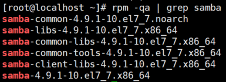

# smb学习笔记

希望能在Windows上读写Linux的文件，并实时生效

用smb实现的极简配置


## 服务端

服务端系统信息：CentOS 7 1611

### 准备工作

1. 关闭firewalld和selinux

   [关闭firewalld](https://www.cnblogs.com/moxiaoan/p/5683743.html)

   [关闭selinux](https://www.cnblogs.com/activiti/p/7552677.html)

2. 安装smb服务

   `yum install samba -y` 

3. 查看安装情况

   `rpm -qa | grep samba`

   

4. 启动smb服务

   下载后，smb服务默认关闭

   `systemctl start smb`

   ---

### 配置smb

smb下载安装完成后，会自动生成配置文件/etc/samba/smb.conf

可以在smb.conf同级目录下，使用`testparm`命令测试smb.conf是否合法

5. 极简smb.conf配置如下

   ```
   # 全局配置；不重要，可以忽略
   [global]
       workgroup = MYGROUP 
       server string = Samba Server Version %v
       log file = /var/log/samba/log.%m
       max log size = 50
   
   # 共享配置
   [root] # Windows将显示的共享文件夹名
       comment = User Directory
       path = /root # Linux要共享出去的目录
       read only = No # 读写权限
   	# 配置新建文件的权限
   	create mode = 0644 # root可读写
   	force create mode = 0644
   	# 配置新建文件夹的权限
   	directory mode = 0755 # root可读写执行
   	force directory mode = 0755 
   ```

### 添加smb用户

6. 执行命令

   `smbpasswd -a root`

   执行后，需要设置密码

   


---


## 客户端

客户端系统信息： win10

### 基本操作

1. 准备工作

   关闭win 10专用网络防火墙

2. win+e，打开文件资源管理器

   或

   win+r，打开运行

3. 在地址栏输入`\\linux IP`如下

   

4. 成功

   


### 映射网络驱动器

https://support.microsoft.com/zh-cn/help/4026635/windows-map-a-network-drive


---


## 错误处理

1. Windows报错：不允许一个用户使用一个以上用户名与服务器或共享资源的多重连接

   [参考链接](https://blog.51cto.com/mengix/1895969)

   1. 运行 - 打开cmd

   2. 查看当前的链接

      `net use`

   3. 清理指定链接

      `net use \\Linux IP\folder /delete`

   

2. Windows报错：没有权限访问

   未创建smb用户（直接为smb创建root用户可能比较省事）


## 参考链接

1. [smb配置文件解析](https://www.cnblogs.com/muscleape/p/6385583.html)
 	2. [极简配置文件参考](https://blog.csdn.net/wh8_2011/article/details/78866644)
 	3. [linux及smb用户的创建](https://blog.csdn.net/l_liangkk/article/details/80712498)
 	4. [linux及smb用户的删除](https://blog.csdn.net/qq_32693119/article/details/80016272)

