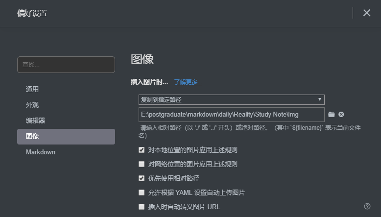

Typora 学习笔记

1. 有序列表，连带文字换行时，序号会自动 +1，如果不希望序号自加

   可以换行后，按 crtl + ] 键

   会于当前有序列表下，再新建一个有序列表，BackSpace删除新表即可

2. 超链接

   语法：`[说明文字](HTTP://链接地址)`

   效果： [说明文字](http://链接地址)

   快捷键：CTRL + K

3. 取消注释

   方向键 ↓ ，跳转到下一行输入

4. 内容折叠

   可以通过HTML实现内容折叠

   

       
展开查看折叠内容

       折叠内容（折叠部分不支持md语法）
   

   
5. 将Windows剪贴的图片保存到git本地仓库中

   这样就可以在远程一样预览

   1. 文件 - 偏好设置 

   2. 偏好设置

      

      1. 对本地图片应用上述规则，即复制到指定路径

         将剪贴板上的图片复制到git本地仓库中的一个文件夹

         文件夹可以通过相对路径配合${filename}参数进行设置
   
      
      
      2. 再选中优先使用相对路径，即可
   
   

