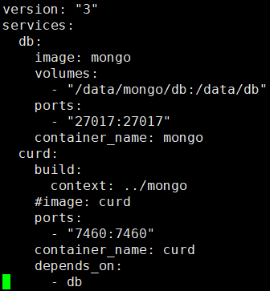

# docker compose使用教程

## 简介

docker compose是用来控制多个容器运行逻辑（容器编排）的工具

不再需要通过docker run命令一个一个启动容器，也不再需要用shell脚本控制容器的启动

## 下载

docker compose不集成在docker中，需要另外下载

[官方文档参考地址](https://docs.docker.com/compose/install/)

1. `curl -L "https://github.com/docker/compose/releases/download/1.25.5/docker-compose-$(uname -s)-$(uname -m)" -o /usr/local/bin/docker-compose`
2. `chmod +x /usr/local/bin/docker-compose`

 ## 配置

docker-compose将容器运行逻辑写进yml文件，然后用docker-compose up命令，启动compose

### 编辑yml文件

[docker-compose.yml文件编辑参考](https://docs.docker.com/compose/compose-file/)

service，network，volume需要配置，但是普通使用只需要用到service

### yml极简配置

```yml
version: '3' // 指定compose版本，和docker版本对应（docker 18.09对应）
services: // service下都是compose要启动的容器
  db: // service名，要启动的服务
    image: dockersamples/example 
    // 镜像名
    // 没有指定build情况下
    // 如果该镜像存在，就用该镜像构建容器
    // 如果该镜像不存在，就从远程下拉镜像
    // 指定build情况下
    // 如果镜像不存在，就以build指定的名字给将构建镜像
    // 如果没有image字段，创建的镜像名默认为 项目名_服务名
    build: // docker 构建镜像时的相关配置
      context: ./MySQL // dockerfile所在目录
      network: host // 指定网络模式
    environment: // 环境变量相关配置
      MYSQL_ROOT_PASSWORD: root // 环境变量
      MYSQL_DATABASE: test_db
      MYSQL_USER: docker
      MYSQL_PASSWORD: docker
    container_name: golang_db // 容器名
    ports: // 指定接口映射，不能和build -> host同时使用
      - "3306:3306"
    volumes: // 文件映射
      - "./Go:/go"
     depends_on: // 容器间的依赖关系
      - db  // compose文件中的其他服务名
      
  app:
    build:
      context: ./Go
    volumes:
      - "./Go:/go"
    container_name: golang_app
    ports:
      - "8080:8080"
    tty: true
```


按照官方文档的描述，compose文件基本涵盖了dockerfile和docker run的一切参数，可以完全依靠compose部署容器


## 实例

```yml
version: "3"
services:
  db:
    image: mongo
    volumes:
      - "/data/mongo/db:/data/db"
    ports:
      - "27017:27017"
    container_name: mongo
  curd:
    build:
      context: ../mongo
    image: curd
    ports:
      - "7460:7460"
    container_name: curd
    depends_on:
      - db
```

**启动流程**

在compose配置文件目录下执行命令，`docker-compose up`

**调试流程**

1. 重新编译项目可执行文件
2. 通过命令`docker-compose up --build -d` 或 `docker-compose build` 重新编译镜像

**特别注意**

在curd容器中，如果想使用mongo，那么mongo url应该写为

`mongodb://[mongo服务名]:27017`

在这里，就是

`mongodb://db:27017`

这与docker run方式启动容器不同，docker run启动时会添加 --net=host 参数，所以其他容器连接mongo数据库，通过localhost即可

而，compose将每个服务都看作是独立的，通过服务名连接访问

而compose方式中的localhost，只表示本服务，可以通过服务名访问其他服务

> 官方文档表示，version 3.4开始在支持 --net=host 模式
>
> ```yml
> build:
>   context: .
>   network: host
> ```
>
> 暂未验证


## 命令

[docker compose命令参考](https://docs.docker.com/compose/reference/overview/)

**常用命令如下**

1. [启动compose](https://docs.docker.com/compose/reference/up/)

   docker-compose [ **-f** 指定配置yml文件 ] [ **-p** 指定项目名称，默认为yml所在目录名 ]  up  [ **-d** ]  [ 服务名 ] 

   + detch模式启动

     docker-compose up -d 

   + 重新编译并启动

     docker-compose up --build -d

2. [重新编译](https://docs.docker.com/compose/reference/build/)

   docker-compose build [服务名]

3. [删除compose](https://docs.docker.com/compose/reference/down/)

   docker-compose down [options]

   + 删除因compose创建的容器和本地镜像（仅删除image字段为空的镜像）

     docker-compose down --rmi local





