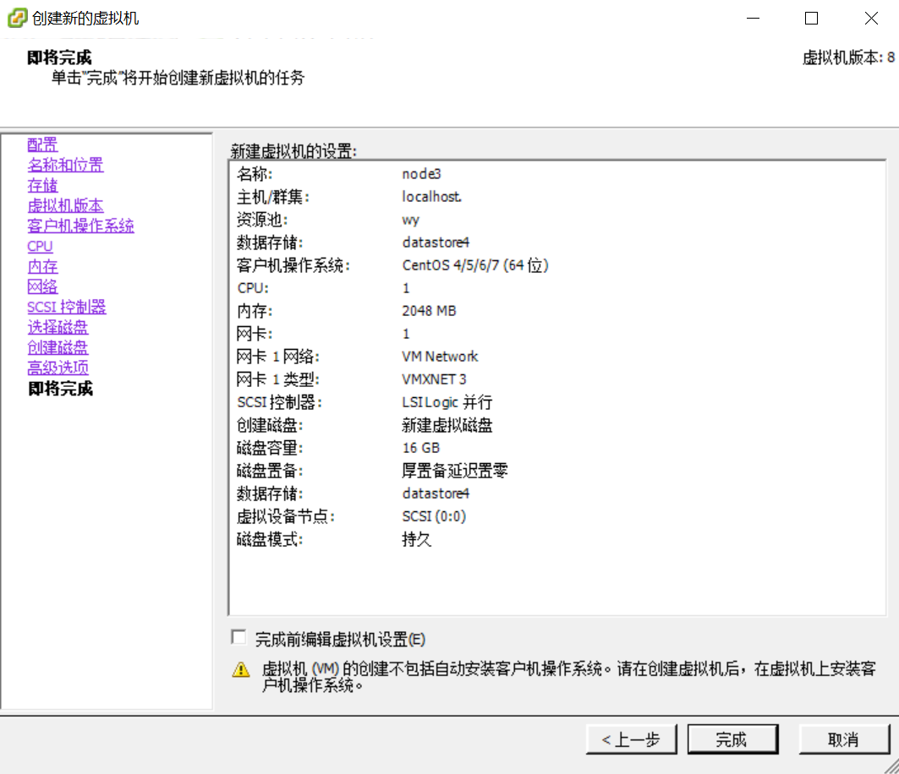
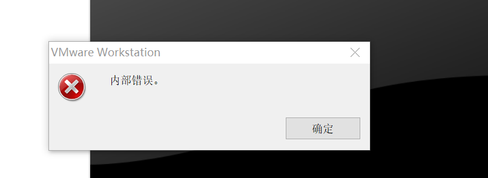
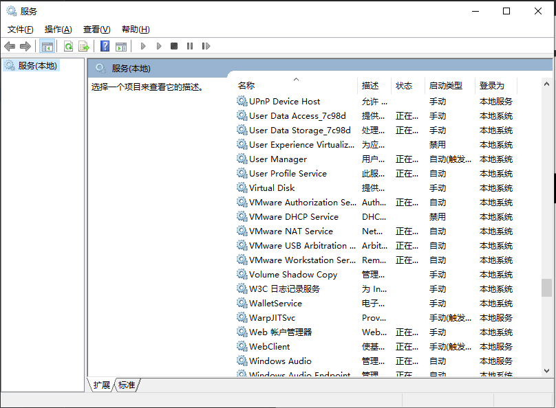
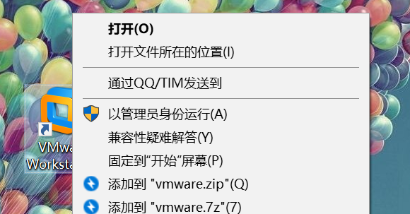

## 虚拟机搭建笔记

### vSphere Client创建虚拟机

1. 新建虚拟机

2. 虚拟机配置

   

3. 选择安装镜像路径，启动安装

4. 配置固定IP

5. **虚拟机连接外网**

   配置DNS：8.8.8.8

   `vi /etc/sysconfig/network-scripts/ifcfg-ens60`

   `vi /etc/resolv.conf`

   > 如果是本地虚拟机，还需要配置虚拟机网络

   

   

---

## 错误处理

1. 开启虚拟机，报错“内部错误”，如下

   

   + VMware服务未启动

     1. win+R

     2. 输入service.msc

     3. 在列表中找到VMware开头的服务

     4. 打开

        

   + 以管理员身份运行VMware

     1. 右键图标

     2. 管理员身份运行

        

   ---

2. 虚拟机连接不到宿主机

   1. 检查宿主机是否有vmnet8虚拟网卡

   2. 将虚拟机网络模式调整为nat模式

   3. 配置虚拟网络编辑器中的nat设置

      配置网段为虚拟机IP所在网段

      nat网关为默认网关

   4. 配置vmnet8网卡，和虚拟网络编辑器一致

   5. 配置虚拟机IP

      

