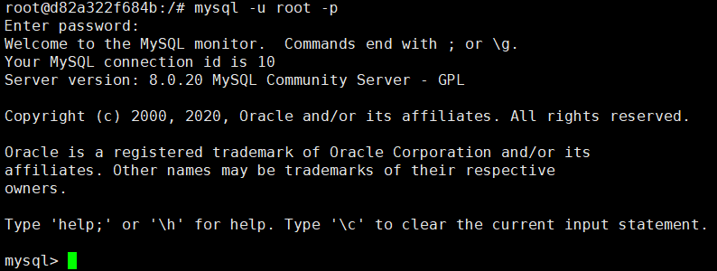

# docker部署MySQL教程

## 简介

MySQL是一种关系型数据库

## 下载

`docker pull mysql[:tag]`

用tag指定版本，默认为latest

[docker hub官方镜像参考](https://hub.docker.com/_/mysql)

## 运行容器

`docker run -itd --name mysql-test -p 3306:3306 -e MYSQL_ROOT_PASSWORD=123456 mysql`

可以通过`mysql -uroot -p`进入容器，通过命令行操作MySQL



### MySQL基本命令

[参考教程](https://www.yiibai.com/mysql/show-databases.html)

1. 创建数据库

   ```sql
   CREATE DATABASE database_name;`
   ```

2. 显示数据库列表

   ```sql
   SHOW DATABASES;
   ```

3. 使用某个数据库

   ```sql
   USE database_name;
   ```

4. 创建表

   ```sql
   CREATE TABLE IF NOT EXISTS table_name (
     column1 INT(11) NOT NULL AUTO_INCREMENT,
     column2 VARCHAR(45) DEFAULT NULL,
     PRIMARY KEY (task_id)
   );
   ```

5. 列出所有表

   ```sql
   SHOW TABLES;
   ```

6. 显示表的结构

   ```sql
   DESCRIBE table_name;
   ```

7. 查询数据

   ```sql
   SELECT column_1,column_2,...  
   FROM table_1;
   ```

   [SELECT参考链接](https://www.yiibai.com/mysql/select-statement-query-data.html)

8. 插入数据

   ```sql
       INSERT INTO table_name(column1,column2...)
       VALUES (value1,value2,...),
              (value1,value2,...);
   ```

9. 修改数据

   ```sql
   UPDATE table_name 
   SET 
       column1 = update_value
   WHERE
       columnX = valueX;
   ```

10. 删除数据

   ```sql
   DELETE FROM table_name 
   WHERE
       columnX = valueX;
   ```

11. 删除数据库

    ```sql
    DROP DATABASE
    ```

[SQL教程]()

## Golang操作MySQL

**重要** ：在import部分加入如下代码，用以执行mysql的init步骤

`import _ github.com/go-sql-driver/mysql`


## 问题及解决

1. docker pull命令失败

   可能是因为国内防火墙的原因

   **方法一**：采用国内镜像

   [国内镜像站](https://hub.daocloud.io/repos)

   `docker pull daocloud.io/library/mysql`

   [参考链接](https://blog.csdn.net/w_bu_neng_ku/article/details/78765251)

   或者

   修改`/etc/docker/daemon.json`文件（如果没有就直接创建）

   ```json
   {
    "registry-mirrors": ["https://docker.mirrors.ustc.edu.cn/"]
   }
   ```

   `systemctl daemon-reload`

   `systemctl restart docker`

   `docker pull mysql`

   [参考链接](https://blog.csdn.net/qq_39329616/article/details/89640731)

   还有[其他镜像站](https://blog.csdn.net/qq_39329616/article/details/89640731)可选择，但是这种方法不能保证获取的镜像是最新的

   

   **方法二**：用一台可以科学上网的电脑代理docker的http/https请求

   [docker proxy官方链接](https://docs.docker.com/config/daemon/systemd/)
**待验证**
   
   [官方链接](https://docs.docker.com/config/daemon/systemd/)

   [参考链接](https://blog.csdn.net/qq_42684642/article/details/85302222)

   

   


